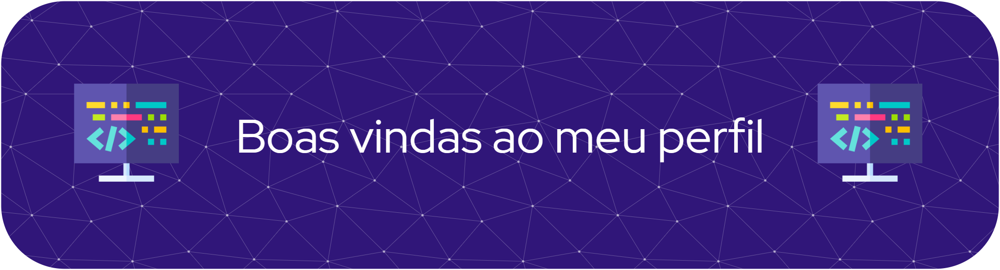

  ### 🤔 Quem sou eu?
  Meu nome é Leonardo e sou graduando de Sistemas de Informação na Universidade Federal de Goiás.
- 🌱 Atualmente estou trabalhando na construção de LLMs para coding e process em Engenharia de Software (AI4SE) no Centro de Excelência em IA (CEIA).
- ⚡ Fato curioso: Ganhei prata nacional e ouro regional competindo pelo Brasil na olimpiada internacional francesa Mathématiques sans Frontières.

## 🌟 Tecnologias que eu trabalho
- HTML
- CSS
- JavaScript
- Linguagem C
- Git e Github
- Python
- Google Colab
- Jupyter Notebook 

          

## ↗️Status do meu perfil

  

   

  

  

### 🔎 Me contate

